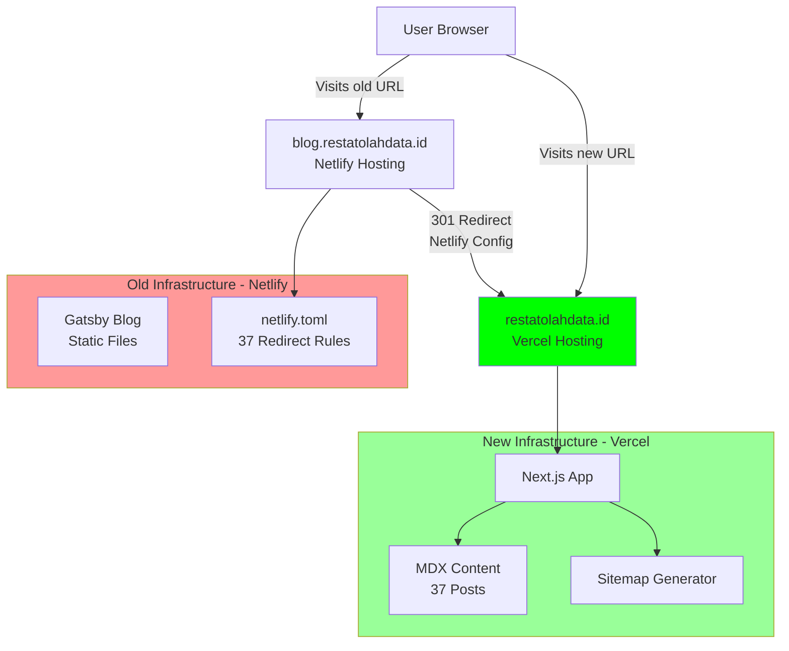

# Blog Migration Plan - SEO Preservation

## Migration Architecture



**Key Architecture Points:**

1. **Old Blog (Netlify):** Handles `blog.restatolahdata.id` → serves only redirects
2. **New Site (Vercel):** Hosts entire Next.js app at `restatolahdata.id`
3. **Traffic Flow:** Old URL → Netlify detects → 301 redirect → Vercel serves content

## Why This Migration Matters: SEO Juice Consolidation

### Current Problem (Subdomain)

Google treats `blog.restatolahdata.id` and `restatolahdata.id` as separate entities:

- Backlinks to blog posts don't fully benefit your main site
- Domain authority is split between two "properties"
- Like having two separate houses - neither gets full value

### After Migration (Subdirectory)

`restatolahdata.id/artikel` lives under main domain:

- Every backlink to blog posts strengthens your ENTIRE domain
- Homepage, product pages, blog all share authority pool
- Like consolidating into one house - much more valuable

### The Trade-off

- **Short-term:** 2-4 weeks of traffic volatility (10-30% dip)
- **Long-term:** Higher overall rankings across ALL pages
- **Net result:** Worth it if you follow migration steps correctly

## URL Mapping Strategy - REVISED

**ACTUAL Old Structure:** `blog.restatolahdata.id/{slug}`

**New Structure:** `restatolahdata.id/artikel/{category}/{slug}`

**Example:**

- Old: `blog.restatolahdata.id/cara-membaca-hasil-output-amos`
- Category: "Interpretasi Hasil" (in metadata, not URL)
- New: `restatolahdata.id/artikel/interpretasi-uji-statistik/cara-membaca-hasil-output-amos`

**Critical Change:** The old blog did NOT include category in URLs! This means:

1. **Can't use simple pattern redirect** - old and new URL structures are incompatible
2. **Need explicit redirect mapping** for all 37 posts (slug → category/slug)
3. **Actually BETTER for SEO** - new URLs have more semantic structure
4. **More complex redirect configuration** - requires a redirect map file

### Why This Is Actually Good News

Adding category to URLs improves SEO:

- More keyword-rich URLs
- Better semantic structure
- Clearer content organization
- Each category becomes a hub page

Google treats this as "URL restructuring" which is normal and expected during redesigns.

## Hosting Infrastructure Overview

### Current Setup

- **Old Blog:** `blog.restatolahdata.id` → Netlify (Gatsby static site)
- **Main Site:** `restatolahdata.id` → Currently deployed (adding `/artikel`)

### After Migration

- **Old Blog:** `blog.restatolahdata.id` → Stays on Netlify → Serves ONLY redirects (no content)
- **New Site:** `restatolahdata.id` → **Vercel** → Full Next.js app with `/artikel` content

### Traffic Flow

```
User → blog.restatolahdata.id/cara-membaca-hasil-output-amos
       ↓
    Netlify (DNS points here)
       ↓
    netlify.toml catches request
       ↓
    Returns 301 Redirect
       ↓
    https://restatolahdata.id/artikel/interpretasi-uji-statistik/cara-membaca-hasil-output-amos
       ↓
    Vercel serves content
```

**Key Point:** You maintain TWO hosting platforms temporarily:

1. **Netlify:** Old subdomain → redirect server
2. **Vercel:** New domain → content server

## Phase 1: Content Structure Setup

### 1.1 Create Content Directory Structure

Create [`content/posts/`](content/posts/) directory in Next.js project to store migrated MDX files maintaining category structure:

```
content/
  posts/
    interpretasi-uji-statistik/
    metode-penelitian/
    metode-statistik/
    software-statistik/
    tutorial-analisis-statistik/
```

### 1.2 Install Required Dependencies

Install packages for MDX processing and SEO:

```bash
npm install next-mdx-remote gray-matter reading-time
npm install -D next-sitemap
```

- `next-mdx-remote`: Server-side MDX rendering
- `gray-matter`: Parse frontmatter from MDX
- `reading-time`: Calculate read time
- `next-sitemap`: Auto-generate sitemap

## Phase 2: Content Migration

### 2.1 Analyze Old Blog URL Structure

**CRITICAL DISCOVERY:** Old blog uses `blog.restatolahdata.id/{slug}` (no category in URL!).

Category information exists in:

- Folder structure: `/content/posts/{category-folder}/{slug}/index.mdx`
- Frontmatter: `category: "Category Name"`

**Example:**

- File: `/restatblog/blog/content/posts/interpretasi-uji-statistik/cara-membaca-hasil-output-amos/index.mdx`
- Old URL: `blog.restatolahdata.id/cara-membaca-hasil-output-amos` ← no category!
- New URL: `restatolahdata.id/artikel/interpretasi-uji-statistik/cara-membaca-hasil-output-amos` ← with category!

### 2.2 Copy MDX Files

Copy all 37 MDX files from:

- Source: [`/restatblog/blog/content/posts/`](/Users/ddedia1/Documents/GitHub/restatblog/blog/content/posts/)
- Target: `/restat_rebrand/content/posts/`

**MAINTAIN EXACT FOLDER STRUCTURE** - this determines category mapping!

### 2.3 Document Slug-to-Category Mapping

While copying, create mapping list:

- `cara-membaca-hasil-output-amos` → folder `interpretasi-uji-statistik`
- `cara-uji-one-way-anova-spss` → folder `tutorial-analisis-statistik`
- etc.

This mapping will be used for redirect configuration.

### 2.4 Transform Frontmatter

Ensure each MDX file has consistent frontmatter matching this schema:

```yaml
---
title: "Article Title"
slug: article-slug  # IMPORTANT: This is the OLD slug (no category)
description: "Meta description for SEO"
date: 2023-03-24
author: "Author Name"
category: "Category Name"  # Used for new URL structure
featured: false
image: "/path/to/image.jpg"
---
```

## Phase 3: Dynamic Routes Implementation

### 3.1 Create Dynamic Route Structure

Create [`app/artikel/[category]/[slug]/page.tsx`](app/artikel/[category]/[slug]/page.tsx):

**Key Requirements:**

- Generate static paths for all posts (SSG)
- Parse MDX content
- Render metadata dynamically

**Implementation:**

```typescript
import { Metadata } from 'next'
import { MDXRemote } from 'next-mdx-remote/rsc'
import { getPostBySlug, getAllPosts } from '@/lib/mdx'

// Generate static params for all posts
export async function generateStaticParams() {
  const posts = getAllPosts()
  return posts.map((post) => ({
    category: post.category,
    slug: post.slug,
  }))
}

// Critical: Generate metadata for SEO
export async function generateMetadata({ params }): Promise<Metadata> {
  const post = getPostBySlug(params.category, params.slug)
  
  return {
    title: post.title,
    description: post.description,
    openGraph: {
      title: post.title,
      description: post.description,
      type: 'article',
      publishedTime: post.date,
      authors: [post.author],
    },
    alternates: {
      canonical: `https://restatolahdata.id/artikel/${params.category}/${params.slug}`
    }
  }
}
```

### 3.2 Create MDX Utilities

Create [`lib/mdx.ts`](lib/mdx.ts) for content management:

```typescript
import fs from 'fs'
import path from 'path'
import matter from 'gray-matter'

const postsDirectory = path.join(process.cwd(), 'content/posts')

export function getAllPosts() {
  // Recursively read all MDX files from category folders
  // Return array of posts with metadata
}

export function getPostBySlug(category: string, slug: string) {
  // Read specific post file
  // Parse frontmatter and content
  // Return post data
}

export function getPostsByCategory(category: string) {
  // Filter posts by category
}
```

## Phase 4: 301 Redirects Configuration

### 4.0 Understanding the Subdomain to Subdirectory Impact

**CRITICAL: Expect 2-4 Weeks of Traffic Volatility**

Moving from subdomain to subdirectory is a "power move" that consolidates domain authority, but comes with short-term risks:

**Current State (Subdomain):**

- `blog.restatolahdata.id` is treated as separate entity from main domain
- Backlinks to blog only partially benefit main site
- Domain authority is split

**New State (Subdirectory):**

- `restatolahdata.id/artikel` shares full domain authority
- All backlinks strengthen the entire domain
- Long-term SEO benefit: Higher overall rankings

**Expected Timeline:**

- Week 1-2: Traffic dip (10-30% typical)
- Week 3-4: Recovery begins as Google reindexes
- Month 2+: Traffic stabilizes or exceeds original levels

**What causes the dip:**

- Google needs time to update its index
- Temporary ranking flux during URL transitions
- Crawler budget reallocation

### 4.1 Create Redirect Mapping (Required for URL Restructuring)

Since old URLs DON'T have category but new ones DO, we need explicit slug mappings.

**Step 1:** Create [`lib/blog-redirects.ts`](lib/blog-redirects.ts) with all 37 posts:

```typescript
// Map: old slug → new category/slug path
export const blogRedirects: Record<string, string> = {
  // NOTE: Complete this mapping after analyzing all 37 MDX files
  // Example entries:
  'cara-membaca-hasil-output-amos': 'interpretasi-uji-statistik/cara-membaca-hasil-output-amos',
  'cara-uji-one-way-anova-spss': 'tutorial-analisis-statistik/cara-uji-one-way-anova-di-spss',
  // ... add all 37 mappings
}
```

**Step 2 (OPTIONAL):** Add backup redirects to [`next.config.ts`](next.config.ts) on Vercel:

```typescript
import { blogRedirects } from './lib/blog-redirects'

const nextConfig = {
  async redirects() {
    // OPTIONAL BACKUP: Only activates if DNS points old subdomain to Vercel
    // Primary redirects handled by Netlify
    const redirectRules = Object.entries(blogRedirects).map(([oldSlug, newPath]) => ({
      source: `/${oldSlug}`,
      has: [
        {
          type: 'host',
          value: 'blog.restatolahdata.id',
        },
      ],
      destination: `https://restatolahdata.id/artikel/${newPath}`,
      permanent: true, // 301 redirect
    }))
    
    return redirectRules
  },
}
```

**Note:** Since old blog DNS points to Netlify, Next.js redirects won't activate. They serve as backup if you later point old subdomain DNS to Vercel.

### 4.1.1 Deployment Architecture Clarification

**YOUR SETUP:**

- **Old Blog:** Netlify hosting `blog.restatolahdata.id` (Gatsby)
- **New Site:** Vercel hosting `restatolahdata.id` (Next.js)

**How Redirects Work:**

1. User visits `blog.restatolahdata.id/cara-membaca-hasil-output-amos`
2. DNS points to **Netlify**
3. Netlify's `netlify.toml` catches request
4. Returns `301 Redirect` to `restatolahdata.id/artikel/...`
5. Browser follows redirect to **Vercel**
6. Vercel serves Next.js content

**Implication:** Next.js `next.config.ts` redirects are **OPTIONAL** (backup only).

Primary redirect handling: **Netlify** (since DNS still points there)

### 4.2 Netlify Redirect Configuration (PRIMARY METHOD)

**IMPORTANT:** Since old URLs lack category structure, Netlify can't handle this with a simple redirect. We have two options:

**Option A: Individual Netlify Redirects (Explicit)**

Create `/restatblog/blog/netlify.toml` with all mappings:

```toml
# Each old slug must map to specific new category/slug
[[redirects]]
  from = "/cara-membaca-hasil-output-amos"
  to = "https://restatolahdata.id/artikel/interpretasi-uji-statistik/cara-membaca-hasil-output-amos"
  status = 301
  force = true

[[redirects]]
  from = "/cara-uji-one-way-anova-spss"
  to = "https://restatolahdata.id/artikel/tutorial-analisis-statistik/cara-uji-one-way-anova-di-spss"
  status = 301
  force = true

# ... repeat for all 37 posts
```

**Option B: Temporary Catch-All (Simpler but less ideal)**

```toml
# Redirect all to artikel listing page temporarily
[[redirects]]
  from = "https://blog.restatolahdata.id/*"
  to = "https://restatolahdata.id/artikel"
  status = 301
  force = true
```

⚠️ **Option B is NOT recommended** - loses specific page redirects, hurts SEO.

**RECOMMENDED:** Use Option A with all 37 explicit mappings. While more work upfront, this preserves page-level SEO equity.

## Phase 5: SEO Infrastructure

### 5.1 Sitemap Generation

Create [`next-sitemap.config.js`](next-sitemap.config.js):

```javascript
module.exports = {
  siteUrl: 'https://restatolahdata.id',
  generateRobotsTxt: true,
  exclude: ['/dashboard', '/order', '/checkout'],
  robotsTxtOptions: {
    policies: [
      {
        userAgent: '*',
        allow: '/',
      },
      {
        userAgent: '*',
        disallow: ['/dashboard', '/order', '/checkout'],
      },
    ],
    additionalSitemaps: [
      'https://restatolahdata.id/sitemap.xml',
    ],
  },
}
```

Add to `package.json` scripts:

```json
{
  "scripts": {
    "postbuild": "next-sitemap"
  }
}
```

### 5.2 Robots.txt

Will be auto-generated by `next-sitemap`, but verify it includes:

```
User-agent: *
Allow: /

Sitemap: https://restatolahdata.id/sitemap.xml
```

### 5.3 Canonical Tags

Each blog post MUST have canonical tag (handled in `generateMetadata`):

```typescript
alternates: {
  canonical: `https://restatolahdata.id/artikel/${category}/${slug}`
}
```

## Phase 6: Internal Linking Preservation

### 6.1 Update MDX Internal Links

Scan all MDX files for internal links pointing to old domain:

**Find and Replace:**

- Old: `https://blog.restatolahdata.id/`
- New: `https://restatolahdata.id/artikel/`

**Example:**

```markdown
<!-- Before -->
[artikel berikut ini](https://blog.restatolahdata.id/penjelasan-lengkap-uji-anova/)

<!-- After -->
[artikel berikut ini](/artikel/metode-statistik/penjelasan-lengkap-uji-anova/)
```

### 6.2 Update Artikel List Page

Update [`app/artikel/page.tsx`](app/artikel/page.tsx):

- Replace hardcoded articles with dynamic content from MDX
- Add links to individual posts: `/artikel/{category}/{slug}`
- Maintain category filtering functionality

## Phase 7: Testing & Validation

### 7.0 CRITICAL SEO VALIDATION CHECKLIST

**Use this checklist to ensure ZERO SEO performance loss. Check every item before launch.**

---

#### ✅ **A. URL & Redirect Validation**

**Purpose:** Ensure all old URLs properly redirect to new ones (preserves ranking history)

| Check | How to Verify | Expected Result | Risk if Missed |

|-------|---------------|-----------------|----------------|

| All 37 posts mapped in `lib/blog-redirects.ts` | Count entries in file | 37 entries | Lost pages = 404s = ranking loss |

| Netlify redirect rules generated | Check `netlify.toml` has 37 `[[redirects]]` blocks | 37 redirect rules | Old URLs return 404 instead of 301 |

| Test 5 sample redirects locally | Visit old URLs in browser | 301 status + redirect works | Broken redirects = lost SEO juice |

| Verify redirect is 301 (not 302) | `curl -I https://blog.restatolahdata.id/sample-post` | `HTTP 301 Moved Permanently` | 302 = temporary = no SEO transfer |

**Command to test:**

```bash
# Test a sample old URL (replace with actual post)
curl -I https://blog.restatolahdata.id/cara-membaca-hasil-output-amos

# MUST show:
# HTTP/1.1 301 Moved Permanently
# Location: https://restatolahdata.id/artikel/interpretasi-uji-statistik/cara-membaca-hasil-output-amos
```

---

#### ✅ **B. Metadata Replication**

**Purpose:** Google identifies pages by metadata - must match original exactly

| Check | How to Verify | Expected Result | Risk if Missed |

|-------|---------------|-----------------|----------------|

| `generateMetadata` function exists | Check `app/artikel/[category]/[slug]/page.tsx `| Function exports `generateMetadata` | No meta tags = lost rankings |

| Title tags generated dynamically | View page source for 3 posts | `<title>` matches original post title | Google sees different page = reindex delay |

| Meta descriptions present | View page source | `<meta name="description">` exists | No description = lost click-through |

| Canonical tags point to NEW domain | View page source | `<link rel="canonical" href="https://restatolahdata.id/artikel/...">` | Points to old domain = confuses Google |

| Open Graph tags for social | View page source | `<meta property="og:title">` etc. exist | Poor social sharing |

| No old domain references | Search codebase: `grep -r "blog.restatolahdata.id" app/` | No results (except in redirects) | Canonical confusion |

**Command to verify metadata:**

```bash
# Check a sample post's metadata
curl -s https://restatolahdata.id/artikel/interpretasi-uji-statistik/cara-membaca-hasil-output-amos | grep -i "canonical"

# MUST show:
# <link rel="canonical" href="https://restatolahdata.id/artikel/interpretasi-uji-statistik/cara-membaca-hasil-output-amos"/>
```

---

#### ✅ **C. Sitemap & Robots.txt**

**Purpose:** Tell Google where to find all your content

| Check | How to Verify | Expected Result | Risk if Missed |

|-------|---------------|-----------------|----------------|

| `next-sitemap` installed | Check `package.json` dependencies | Listed in devDependencies | No sitemap generated |

| `next-sitemap.config.js` exists | Check file exists in root | File present | Sitemap not configured |

| Postbuild script configured | Check `package.json` scripts | `"postbuild": "next-sitemap"` | Sitemap not auto-generated |

| Sitemap.xml accessible | Visit `https://restatolahdata.id/sitemap.xml` | XML file with all 37+ URLs | Google can't discover pages |

| Sitemap includes all artikel URLs | Count `<url>` entries in sitemap | At least 37 artikel URLs | Missing pages won't be crawled |

| Robots.txt exists | Visit `https://restatolahdata.id/robots.txt` | File exists, allows crawling | Google blocked from crawling |

| Robots.txt allows /artikel | Check robots.txt content | No `Disallow: /artikel` | Artikel pages blocked |

| Sitemap URL in robots.txt | Check robots.txt | Contains `Sitemap: https://restatolahdata.id/sitemap.xml` | Google may not find sitemap |

**Commands to verify:**

```bash
# Check sitemap is accessible
curl -I https://restatolahdata.id/sitemap.xml
# Should return: HTTP 200 OK

# Check sitemap content
curl -s https://restatolahdata.id/sitemap.xml | grep -c "<url>"
# Should return: 37+ (number of URLs)

# Check robots.txt
curl -s https://restatolahdata.id/robots.txt | grep -i "sitemap"
# Should show: Sitemap: https://restatolahdata.id/sitemap.xml
```

---

#### ✅ **D. Content Preservation**

**Purpose:** Ensure content is identical to original (Google penalizes content changes during migration)

| Check | How to Verify | Expected Result | Risk if Missed |

|-------|---------------|-----------------|----------------|

| All 37 MDX files copied | Count files in `content/posts/` | 37 .mdx files | Missing content = lost rankings |

| Images copied and accessible | Check 3-5 posts with images | Images display correctly | Broken images = poor UX = ranking drop |

| Image paths updated if needed | Check MDX files for image references | Paths work in new structure | 404 images |

| Content renders correctly | View 5 random posts | Formatting matches original | Poor formatting = higher bounce rate |

| Author names preserved | Check bylines on posts | Match original blog | Authority signals lost |

| Publish dates preserved | Check dates on posts | Match original blog | Freshness signals lost |

| Category associations correct | Check post categories | Match original structure | Wrong categorization |

**Spot check command:**

```bash
# Count MDX files
find content/posts -name "*.mdx" | wc -l
# Should return: 37
```

---

#### ✅ **E. Internal Linking**

**Purpose:** Preserve link equity within your site

| Check | How to Verify | Expected Result | Risk if Missed |

|-------|---------------|-----------------|----------------|

| Internal links updated | Search MDX: `grep -r "blog.restatolahdata.id" content/` | No results | Links point to old domain = redirect chains |

| Relative links used | Check MDX files | Links use `/artikel/` format | Absolute old URLs = problems |

| Artikel listing page links work | Visit `/artikel` page | All post links clickable | Broken navigation |

| Category filter works | Test filters on `/artikel` page | Filters show correct posts | Poor UX |

| Related posts links (if any) | Check "Related Posts" sections | Links work | Broken links = poor UX |

**Command to verify:**

```bash
# Find any old domain references in content
grep -r "blog.restatolahdata.id" content/posts/

# MUST return: no results (or only in commented sections)
```

---

#### ✅ **F. Technical SEO**

**Purpose:** Ensure technical infrastructure supports SEO

| Check | How to Verify | Expected Result | Risk if Missed |

|-------|---------------|-----------------|----------------|

| Page load speed < 3 seconds | Test with Chrome DevTools | LCP < 2.5s | Poor Core Web Vitals = ranking loss |

| Mobile responsive | Test on mobile device | Renders correctly | Mobile-first indexing penalty |

| HTTPS enabled | Check URL in browser | Shows padlock icon | Security penalty |

| No duplicate content | Check each URL loads unique content | No duplicates | Duplicate content penalty |

| Structured data (if original had it) | View page source, look for JSON-LD | Schema.org markup present | Lost rich snippets |

| 404 page exists | Visit `/artikel/non-existent-page` | Custom 404 page | Poor UX |

**Tools to use:**

- [Google PageSpeed Insights](https://pagespeed.web.dev/)
- Chrome DevTools Lighthouse
- Mobile-Friendly Test

---

#### ✅ **G. Google Search Console Setup**

**Purpose:** Monitor migration and catch issues early

| Check | How to Verify | Expected Result | Risk if Missed |

|-------|---------------|-----------------|----------------|

| Old property verified | GSC shows `blog.restatolahdata.id` | Property active | Can't monitor old traffic |

| New property verified | GSC shows `restatolahdata.id` | Property active | Can't monitor new traffic |

| Sitemap submitted to new property | Check Sitemaps section in GSC | Submitted and processing | Google won't discover pages quickly |

| No manual actions on either property | Check Security & Manual Actions | No issues | Existing penalties carry over |

---

### 7.1 PRE-LAUNCH CHECKLIST (CONDENSED)

**STOP:** Do not proceed with launch until ALL items are verified:

**Content Verification:**

- [ ] All 37 MDX files copied with images to `content/posts/`
- [ ] All posts render correctly at `restatolahdata.id/artikel/{category}/{slug}`
- [ ] Images display correctly (no broken image links)
- [ ] Author names and dates preserved from original

**SEO Technical:**

- [ ] Run `curl -I` on 5 sample new URLs - verify meta tags present
- [ ] Canonical tags point to NEW domain (not old subdomain)
- [ ] Open Graph tags present for social sharing
- [ ] Each post has unique title and description (no duplicates)

**Navigation & Links:**

- [ ] Internal links updated from `blog.restatolahdata.id` to `/artikel/`
- [ ] Category links work on `/artikel` listing page
- [ ] Search functionality works (if present)
- [ ] Breadcrumb navigation includes correct paths

**Infrastructure:**

- [ ] `sitemap.xml` generated at `restatolahdata.id/sitemap.xml`
- [ ] Sitemap contains all 37 blog post URLs
- [ ] `robots.txt` exists and allows crawling of `/artikel`
- [ ] Wildcard redirect configured in `next.config.ts`

**Google Search Console:**

- [ ] Old subdomain property (`blog.restatolahdata.id`) verified and active
- [ ] Main domain property (`restatolahdata.id`) verified
- [ ] Ready to submit new sitemap immediately post-launch

### 7.2 POST-LAUNCH: First 24 Hours (CRITICAL)

**Immediately after launch, verify these within 24 hours:**

| Hour | Action | Tool | What to Check | Red Flag |

|------|--------|------|---------------|----------|

| **0-1** | Submit sitemap to GSC | Google Search Console | Sitemap status: "Success" | Error or "Couldn't fetch" |

| **0-1** | Test 10 old URLs | Browser | All redirect to new domain | 404 or timeout |

| **0-2** | Check server logs | Vercel Dashboard | No 404 errors on `/artikel/*` | High 404 rate |

| **2-4** | Monitor Netlify | Netlify Analytics | Requests being received | No traffic = DNS issue |

| **4-8** | Check GSC old property | Google Search Console | Impressions dropping | Impressions flat = redirects not working |

| **8-24** | Check new property | Google Search Console | New URLs appearing | No new URLs = sitemap issue |

| **24** | Check Analytics | Google Analytics / Vercel | Traffic on new URLs | No traffic = major problem |

**Emergency Actions if Red Flags Appear:**

| Problem | Diagnosis | Fix |

|---------|-----------|-----|

| Old URLs return 404 | Netlify redirects not deployed | Redeploy `netlify.toml` to Netlify |

| New URLs return 404 | Vercel deployment failed | Check Vercel build logs, redeploy |

| Redirects show 302 (not 301) | Wrong status code in config | Change `status: 302` to `status: 301` in netlify.toml |

| No traffic on new site | DNS not pointing correctly | Check DNS records, may need 24-48hrs |

| GSC shows errors | Various issues | Click into specific errors in GSC |

### 7.3 Staging Environment Testing (If Available)

Test on staging URL before production:

```bash
# Test a sample redirect (replace with your staging URL)
curl -I https://staging.restatolahdata.id/tutorial-analisis-statistik/cara-uji-one-way-anova-di-spss

# Verify metadata
curl -s https://staging.restatolahdata.id/artikel/tutorial-analisis-statistik/cara-uji-one-way-anova-di-spss | grep -i "canonical"
```

### 7.2 Redirect Testing

Test redirects before going live:

```bash
curl -I https://blog.restatolahdata.id/tutorial-analisis-statistik/cara-uji-one-way-anova-di-spss
# Should return 301 and Location header with new URL
```

### 7.3 WEEKLY MONITORING: First Month After Launch

**Track these metrics WEEKLY to ensure SEO recovery:**

#### Week 1: "The Dip" - Expected Traffic Drop

**🎯 Goal:** Confirm redirects working, minimize damage

| Metric | Where to Check | What's Normal | Action Needed |

|--------|----------------|---------------|---------------|

| **Old URLs (GSC)** | blog.restatolahdata.id property | Impressions ↓ 50-80% | ✅ Good = redirects working |

| **New URLs (GSC)** | restatolahdata.id property | 5-10 new URLs indexed | ❌ If 0 = request indexing manually |

| **404 Errors (GSC)** | Coverage → Excluded | 0-2 errors max | ❌ If >5 = fix redirects immediately |

| **Total Traffic** | Analytics | ↓ 10-30% | ✅ Expected, ❌ if >50% investigate |

| **Redirect Status** | Netlify logs | All returning 301 | ❌ Any 404s = broken redirects |

**Action Items:**

- [ ] Screenshot GSC metrics for baseline
- [ ] List any 404 errors found
- [ ] Manually request indexing for top 10 posts in GSC

---

#### Week 2: "The Recovery Begins"

**🎯 Goal:** Verify Google is reindexing, traffic stabilizing

| Metric | Where to Check | What's Normal | Action Needed |

|--------|----------------|---------------|---------------|

| **New URLs Indexed** | GSC → Index Coverage | 15-25 URLs indexed | ❌ If <10 = submit sitemap again |

| **Old URLs** | Old GSC property | Impressions ↓ 80-90% | ✅ Good |

| **Click-Through Rate** | GSC → Performance | Maintained or improved | ❌ If dropped = check meta descriptions |

| **Average Position** | GSC → Performance | Fluctuating (normal) | ❌ If all drop >10 positions = problem |

| **Core Web Vitals** | GSC → Experience | All "Good" or better | ❌ If "Poor" = speed optimization needed |

**Action Items:**

- [ ] Compare top 10 posts: old vs new rankings
- [ ] Document any ranking drops >5 positions
- [ ] Check page speed for slow posts

---

#### Week 3-4: "Stabilization"

**🎯 Goal:** Traffic recovering to pre-migration levels

| Metric | Where to Check | What's Normal | Action Needed |

|--------|----------------|---------------|---------------|

| **All URLs Indexed** | GSC → Index Coverage | 35+ URLs (all posts) | ❌ If <30 = investigate unindexed pages |

| **Total Traffic** | Analytics | 70-90% of pre-migration | ✅ On track |

| **Ranking Recovery** | GSC → Performance | Most keywords back to original position ±3 | ❌ If still down = review content/metadata |

| **Backlink Status** | Ahrefs/SEMrush (if available) | Backlinks show new URLs | Follow up with high-value sites |

| **Old Property** | Old GSC | Impressions near zero | ✅ Perfect |

**Action Items:**

- [ ] Identify posts that haven't recovered rankings
- [ ] Review metadata for struggling posts
- [ ] Consider updating content for low performers

---

### 7.4 SEO Health Scorecard Template

**Use this to track SEO health weekly:**

```
Migration Week: ____ (1-4)
Date: __________

✅ Green = Good | ⚠️ Yellow = Monitor | 🔴 Red = Act Now

[ ] Redirects Status: All 301s working (test 5 random)
[ ] Indexed Pages: ____ / 37 posts in new GSC
[ ] 404 Errors: ____ errors (target: 0)
[ ] Traffic Level: ____ % of pre-migration
[ ] Avg. Position: Changed by ____ positions (±3 is normal)
[ ] Core Web Vitals: LCP ____ / FID ____ / CLS ____

Top 3 Concerns:
1. ________________
2. ________________
3. ________________

Actions Taken This Week:
- ________________
- ________________
```

**Save this scorecard each week to track trends.**

---

### 7.5 Google Search Console Strategy

**CRITICAL: Maintain Both Properties During Transition**

**Setup (Before Launch):**

1. **Keep Old Subdomain Property:** `blog.restatolahdata.id`

   - Do NOT delete this property
   - Use it to monitor traffic drop-off
   - Confirms redirects are working

2. **Add/Verify New Property:** `restatolahdata.id`

   - Should already exist for main site
   - Will cover `/artikel` subdirectory automatically

**Immediately After Launch:**

1. **Submit New Sitemap:** `https://restatolahdata.id/sitemap.xml`

   - Contains all new `/artikel` URLs
   - Forces Google to discover new structure

2. **Monitor Old Property:**

   - Traffic should DROP rapidly (good sign = redirects working)
   - Check for 404 errors (bad sign = redirects broken)
   - If traffic stays flat = redirects aren't firing

3. **Monitor New Property:**

   - Watch Index Coverage for new URLs appearing
   - Check for crawl errors on `/artikel` paths

**What to Watch For:**

- Old property: Traffic declining = ✓ Redirects working
- New property: Pages indexed increasing = ✓ Google discovering content
- Old property: 404 errors = ✗ Fix broken redirects immediately

---

## 🚨 QUICK REFERENCE: THE 5 CRITICAL SEO CHECKS

**Print this and check BEFORE launch:**

### 1️⃣ REDIRECTS (301, not 302)

```bash
curl -I https://blog.restatolahdata.id/any-old-post
# MUST show: HTTP/1.1 301 Moved Permanently
```

### 2️⃣ CANONICAL TAGS (point to NEW domain)

```bash
curl -s https://restatolahdata.id/artikel/category/slug | grep canonical
# MUST show: restatolahdata.id (NOT blog.restatolahdata.id)
```

### 3️⃣ SITEMAP (accessible and complete)

```bash
curl -s https://restatolahdata.id/sitemap.xml | grep -c "<url>"
# MUST show: 37+ (number of posts)
```

### 4️⃣ METADATA (title, description on every page)

```
Visit 3 random posts → View Source → Search for:
- <title> tag exists
- <meta name="description"> exists
- <link rel="canonical"> exists
```

### 5️⃣ INTERNAL LINKS (no old domain references)

```bash
grep -r "blog.restatolahdata.id" content/posts/
# MUST return: 0 results
```

**If ANY of these 5 fail, DO NOT LAUNCH. These are NON-NEGOTIABLE for SEO preservation.**

---

## Phase 8: Post-Launch Monitoring

### 8.1 Week 1-2: The Volatility Period

**Expected Behavior (NORMAL):**

- Traffic drops 10-30% as Google processes changes
- Old URLs return 301 redirects
- New URLs appear in GSC Index Coverage
- Some rankings fluctuate

**Action Items:**

- Daily check of GSC for errors
- Monitor Analytics for traffic source shifts
- Document ranking changes for key posts
- DO NOT PANIC - This is expected!

**Red Flags (PROBLEMS):**

- Traffic drops >50% = Check redirects immediately
- 404 errors in old GSC property = Broken redirects
- New URLs not appearing in index = Sitemap issues

### 8.2 Week 3-4: Recovery Phase

**Expected Behavior:**

- Traffic begins recovering
- Google finishes reindexing most URLs
- Rankings stabilize

**Action Items:**

- Compare traffic to pre-migration baseline
- Identify any posts with persistent ranking drops
- Update external backlinks where possible

### 8.3 Month 2+: Stabilization

**Expected Outcome:**

- Traffic equals or exceeds pre-migration levels
- All old URLs fully reindexed to new structure
- Domain authority consolidation shows benefits

**Final Actions:**

- After 3 months of stable traffic, can remove old GSC property
- Document SEO performance changes
- Share migration learnings with team

## Critical Success Factors

1. **No Downtime:** Both old and new must work during transition
2. **Exact Metadata Match:** Title, description, canonical must match original
3. **301 Redirects:** Must be permanent (not 302) for SEO juice transfer
4. **Sitemap Update:** Submit immediately after launch
5. **Internal Links:** All must point to new structure

## Risk Mitigation

### If Rankings Drop >30% or Don't Recover After 4 Weeks

**Diagnosis Checklist:**

1. **Test Redirects Manually**
   ```bash
   curl -I https://blog.restatolahdata.id/tutorial-analisis-statistik/cara-uji-one-way-anova-di-spss
   
   # Should return:
   # HTTP/1.1 301 Moved Permanently
   # Location: https://restatolahdata.id/artikel/tutorial-analisis-statistik/cara-uji-one-way-anova-di-spss
   ```


If you get 404 or 302 (temporary), redirects are misconfigured.

2. **Check Canonical Tags**

View page source on new URLs:

   ```html
   <!-- CORRECT -->
   <link rel="canonical" href="https://restatolahdata.id/artikel/category/slug" />
   
   <!-- WRONG - Still pointing to old domain -->
   <link rel="canonical" href="https://blog.restatolahdata.id/category/slug" />
   ```

3. **Verify GSC Index Coverage**

   - Old property: Should show declining impressions
   - New property: Should show new URLs appearing
   - If old property shows 404s = redirects broken
   - If new property shows "Discovered - not indexed" = wait longer or fetch in GSC

4. **Check for Broken Internal Links**
   ```bash
   # Search for old domain references in MDX files
   grep -r "blog.restatolahdata.id" content/posts/
   ```

5. **Verify Sitemap Submitted**

   - Check GSC Sitemaps section
   - Should show `restatolahdata.id/sitemap.xml`
   - Status should be "Success"

**Emergency Actions:**

If traffic drops >50% and doesn't recover after 2 weeks:

1. Force Google to recrawl: Use "Request Indexing" in GSC for top 10 posts
2. Check server logs to confirm Googlebot is receiving 301s
3. Temporarily add `<meta name="robots" content="noindex">` to old subdomain (if still accessible) to force Google to ignore old URLs
4. Reach out to Google Search Central community forums with specifics

## Deployment Order (CRITICAL - Follow Exactly)

### Phase A: Prepare (All Development Complete)

1. All MDX files copied and tested
2. Dynamic routes working locally
3. Metadata generating correctly
4. Sitemap configuration ready

### Phase B: Deploy Next.js App to Vercel

1. **Connect GitHub repository to Vercel:**

   - Push code to GitHub
   - Import project in Vercel dashboard
   - Vercel auto-detects Next.js configuration

2. **Deploy to production:**

   - Deploy to `restatolahdata.id` domain
   - Verify build succeeds
   - Test `/artikel` URLs are accessible on Vercel

3. **Verify dynamic routes work:**

   - Visit 3-5 sample article URLs
   - Check metadata in browser dev tools
   - Ensure images display correctly

4. **DO NOT touch old blog DNS** - traffic still goes to Netlify

### Phase C: Configure Netlify Redirects

1. Update `restatblog/blog/netlify.toml` with redirect
2. Deploy to Netlify
3. Test: Visit `blog.restatolahdata.id/any-post` - should redirect to new domain
4. Old blog now redirecting ALL traffic

### Phase D: Submit to Google

1. Submit new sitemap in GSC within 1 hour
2. Monitor both properties daily
3. Do NOT delete old GSC property for 3 months

### Phase E: Vercel Configuration Check

**After deployment, verify in Vercel dashboard:**

1. **Domain Configuration:**

   - Primary: `restatolahdata.id`
   - Ensure SSL certificate is active

2. **Build Settings:**

   - Framework Preset: Next.js
   - Build Command: `npm run build`
   - Output Directory: `.next`

3. **Environment Variables (if any):**

   - Add any required env vars for production

4. **Analytics (Optional):**

   - Enable Vercel Analytics for traffic monitoring
   - Helps track migration impact

### Phase F: Optional DNS Migration (Later)

After 2-4 weeks when traffic stabilizes:

- **Option A (Recommended):** Keep `blog.restatolahdata.id` on Netlify serving redirects (simpler, no DNS changes)
- **Option B:** Point old subdomain DNS to Vercel (requires DNS config, Next.js redirects will activate)

## File Structure After Migration

```
restat_rebrand/
├── app/
│   └── artikel/
│       ├── page.tsx (listing page)
│       └── [category]/
│           └── [slug]/
│               └── page.tsx (individual post)
├── content/
│   └── posts/
│       ├── interpretasi-uji-statistik/
│       ├── metode-penelitian/
│       ├── metode-statistik/
│       ├── software-statistik/
│       └── tutorial-analisis-statistik/
├── lib/
│   └── mdx.ts (content utilities)
├── next-sitemap.config.js
└── next.config.ts (with redirects)
```

## Summary: Keys to Success

### Infrastructure

1. **New site deployed on Vercel** - `restatolahdata.id` with full Next.js app
2. **Old blog stays on Netlify** - `blog.restatolahdata.id` serves only redirects
3. **Two hosting platforms work together** - Netlify catches → redirects → Vercel serves

### SEO Migration

4. **Create explicit redirect mapping** - old URLs lack category, new ones have it (structural change)
5. **Map all 37 posts individually** - slug-only → category/slug requires explicit mappings
6. **Expect 2-4 weeks of volatility** - don't panic when traffic dips
7. **Monitor both GSC properties** - old shows redirects working, new shows indexing
8. **Configure Netlify redirects** - primary redirect handler (DNS points there)
9. **Submit sitemap immediately** - forces Google to discover new structure
10. **Keep old GSC property active** - need it for monitoring for 3 months

### Critical Insights

- **URL Structure:** `blog.restatolahdata.id/slug` → `restatolahdata.id/artikel/category/slug`
- **Hosting:** Netlify (redirect) + Vercel (content)
- **Timeline:** 2-4 weeks for Google to reindex and traffic to stabilize

**The migration is complete when:**

- All old URLs return 301 redirects (Netlify → Vercel)
- New URLs appear in GSC index coverage
- Traffic recovers to pre-migration levels
- Rankings stabilize (within 30 days)
- Vercel deployment serving content reliably

**Infrastructure Success Checklist:**

- ✅ Netlify: Redirecting `blog.restatolahdata.id/*` → `restatolahdata.id/artikel/*`
- ✅ Vercel: Serving Next.js content at `restatolahdata.id/artikel/*`
- ✅ Both platforms working together seamlessly

### SEO Validation Reference

- **Phase 7.0:** Comprehensive validation tables (7 categories covering all SEO factors)
- **Quick Reference:** 5 Critical SEO Checks (print and check before launch)
- **Phase 7.2:** First 24 hours monitoring table (hour-by-hour)
- **Phase 7.3:** Weekly monitoring checklists (Weeks 1-4)
- **Phase 7.4:** SEO Health Scorecard template (track trends)

**These validation tools ensure you catch and fix issues BEFORE they impact rankings.**