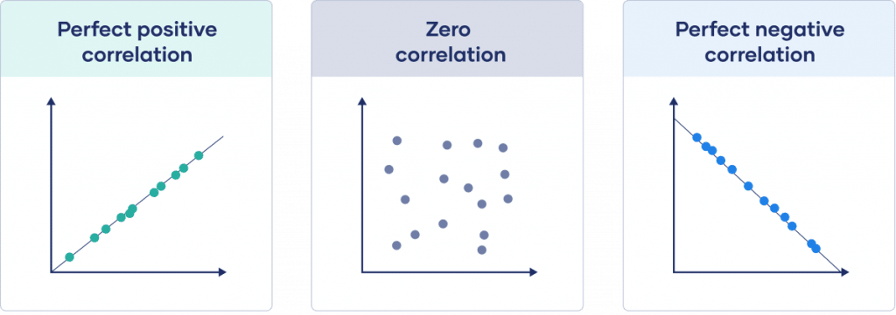

# Pengertian Korelasi

Korelasi adalah salah satu metode statistik yang digunakan untuk mengetahui hubungan antara dua variabel. Biasanya uji korelasi ini akan sangat berhubungan dengan uji regresi yang menunjukkan apakah masing-masing variabel saling mempengaruhi. Meskipun variabel tersebut saling berhubungan erat atau berkorelasi, belum tentu variabel tersebut saling mempengaruhi. 

**Penting: Analisis korelasi tidak dapat digunakna untuk mengetahui sebab-akibat, hanya untuk mengetahui kuat dan lemahnya hubungan antar 2 variabel. Jika anda akan melakukan analisis sebab-akibat, lebih cocoknya anda menggunakan analisis [regresi berganda](/artikel/penggunaan-regresi-linear-berganda/) atau [regresi logistik](/artikel/penggunaan-regresi-logistik-dan-penerapannya/).**

Dalam korelasi, kita mengukur seberapa dekat hubungan antara dua variabel dengan menghitung koefisien korelasi. Koefisien korelasi dapat bernilai antara -1 dan 1, di mana nilai 1 menunjukkan hubungan yang sempurna positif, nilai -1 menunjukkan hubungan yang sempurna negatif, dan nilai 0 menunjukkan tidak ada hubungan antara kedua variabel.

# Contoh Uji Korelasi

* untuk mengevaluasi hubungan antara tinggi badan dan berat badan seseorang
* untuk mengevaluasi hubungan antara pengalaman kerja dan gaji yang diterima
* hubungan antara jenis kelamin dan preferensi genre film

# Jenis-Jenis Korelasi

Dalam analisis statistik, korelasi digunakan untuk mengukur hubungan antara dua variabel. Terdapat tiga jenis korelasi yang umum digunakan, yaitu korelasi Pearson, korelasi Spearman, dan korelasi Kendall. Dalam artikel ini, kita akan membahas masing-masing jenis korelasi secara detail.

## 1. Korelasi Pearson

**Korelasi Pearson adalah** korelasi yang digunakan untuk mengukur hubungan linier antara dua variabel yang berskala interval atau rasio. Koefisien korelasi Pearson dapat bernilai antara -1 dan 1, di mana nilai 1 menunjukkan hubungan yang sempurna positif, nilai -1 menunjukkan hubungan yang sempurna negatif, dan nilai 0 menunjukkan tidak ada hubungan antara kedua variabel.

**Contoh penggunaan korelasi Pearson adalah** untuk mengevaluasi hubungan antara tinggi badan dan berat badan seseorang. Dalam hal ini, kita dapat mengukur koefisien korelasi Pearson untuk menentukan seberapa dekat hubungan antara kedua variabel tersebut.

## 2. Korelasi Spearman

**Korelasi Spearman adalah** korelasi yang digunakan untuk mengukur hubungan antara dua variabel yang tidak bersyarat normal atau tidak memiliki hubungan linier yang kuat. Korelasi Spearman dapat digunakan untuk mengukur hubungan antara dua variabel yang berskala ordinal atau interval.

**Contoh penggunaan korelasi Spearman adalah** untuk mengevaluasi hubungan antara pengalaman kerja dan gaji yang diterima. 

## 3. Korelasi Data Kategorik

Selain korelasi antar variabel kontinu, terdapat juga korelasi antara variabel kategorik. Korelasi ini dikenal dengan Coefficient of Contingency (C). C sering digunakan untuk mengukur kekuatan hubungan antara dua variabel kategorik dalam bentuk tabel silang (contingency table). Untuk menguji apakah hubungannya signifikan atau tidak dapat menggunakan uji chi-square

**Contoh kasus penggunaan Coefficient of Contingency adalah** ketika ingin mengetahui hubungan antara jenis kelamin dan preferensi genre film. Maka, dapat dibuat tabel silang (contingency table) yang menunjukkan jumlah responden berdasarkan jenis kelamin dan genre film yang disukai. 

# Cara Memilih Jenis Korelasi

# Interpretasi Uji Korelasi

Interpretasi hasil korelasi adalah langkah penting dalam analisis korelasi, karena hasil korelasi yang tepat dapat memberikan pemahaman yang lebih baik tentang hubungan antara dua variabel. Ada beberapa hal yang perlu dipertimbangkan saat menafsirkan hasil korelasi.

## 1. Koefisien Korelasi

Koefisien korelasi adalah ukuran seberapa kuat hubungan antara dua variabel. Koefisien korelasi berkisar dari -1 hingga 1. Jika koefisien korelasi adalah 1, itu berarti ada hubungan positif sempurna antara kedua variabel. Jika koefisien korelasi adalah -1, itu berarti ada hubungan negatif sempurna antara kedua variabel. Jika koefisien korelasi adalah 0, itu berarti tidak ada hubungan antara kedua variabel.

## 2. Signifikansi

Signifikansi menunjukkan apakah hubungan antara dua variabel itu nyata atau hanya kebetulan belaka. Nilai signifikansi yang kurang dari 0,05 menunjukkan bahwa hubungan itu signifikan secara statistik. Artinya, kemungkinan hubungan itu terjadi karena kebetulan sangat kecil.

## 3. Pengaruh Outlier

Outlier adalah nilai yang jauh berbeda dari nilai lain dalam dataset. Outlier dapat mempengaruhi hasil korelasi dan menyebabkan interpretasi yang salah. Oleh karena itu, perlu memperhatikan apakah ada outlier dalam dataset saat menafsirkan hasil korelasi.

## 4. Korelasi vs Kausalitas

Perlu diingat bahwa korelasi tidak selalu sama dengan kausalitas. Korelasi hanya menunjukkan adanya hubungan antara dua variabel, tetapi tidak dapat menentukan apakah salah satu variabel menyebabkan perubahan pada variabel lain.

# Langkah Selanjutnya

Setelah anda memahami penggunaan analisis korelasi, jenis-jenis korelasi dan interpretasinya. Selanjutnya kita akan belajar bagaimana cara menghitung pada masing-masing jenis korelasi

* [Korelasi Pearson](/artikel/cara-uji-korelasi-pearson-dengan-spss/)
* Korelasi Spearman (coming soon)
* [Korelasi Data Kategorik](/artikel/cara-uji-chi-square-di-spss/)