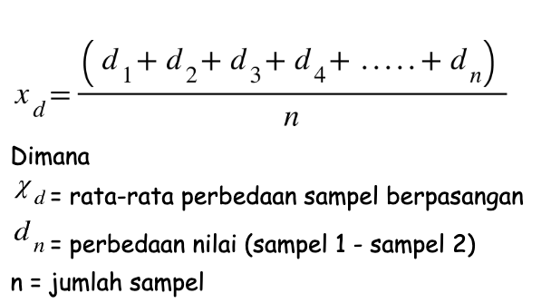
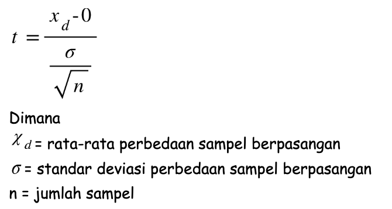

Uji T berpasangan adalah metode statistik yang digunakan untuk mengetahui apakah terdapat perbedaan rata-rata antara 2 sampel.

Kenapa disebut berpasangan? Karena sebenarnya sampel yang di teliti adalah group yang sama, tetapi di ukur dua kali (sebelum vs sesudah). Sehingga menghasilkan 2 sampel yang berpasangan. 

Penggunaan uji t berpasangan umumnya digunakan untuk mengetahui pengaruh dari metode. Misalnya, apakah terdapat perbedaan nilai siswa sebelum dan sesudah diberikan metode belajar studi kasus. Selain itu, apakah terdapat perbedaan imunitas tubuh sebelum dan sesudah terkena covid.

# Hipotesis Uji T Berpasangan

Seperti banyak prosedur statistik, uji t berpasangan memiliki dua hipotesis, yaitu hipotesis nol dan hipotesis alternati. Hipotesis nol mengasumsikan bahwa tidak terdapat perbedaan rata-rata sebenarnya antara sampel berpasangan. Sebaliknya, hipotesis alternatif mengasumsikan bahwa terdapat perbedaan rata-rata antara sampel berpasangan. Hipotesis alternatif terdapat 3 tipe, dan kita bisa memilih salah satunya sesuai dengan hipotesis penelitian yang akan kita jawab.

Jika tujuannya adalah untuk mengukur perbedaan rata-rata tidak sama dengan nol, hipotesis dua sisi digunakan. Jika arah perbedaan antara rata-rata sampel dan nilai perbandingan ingin diketahui (lebih besar atau lebih kecil dari 0), maka hipotesis satu arah dapat digunakan.

Hipotesis nol tetap sama untuk setiap jenis hipotesis alternatif. Hipotesis uji  t berpasangan secara formal didefinisikan di bawah ini:

* Hipotesis nol (𝐻0) mengasumsikan bahwa perbedaan rata-rata sama dengan nol.
* Hipotesis alternatif dua arah (𝐻1) mengasumsikan bahwa perbedaan rata-rata tidak sama dengan nol
* Hipotesis alternatif arah lebih besar (𝐻1) mengasumsikan bahwa perbedaan rata-rata lebih besar dari nol.
* Hipotesis alternatif arah lebih kecil (𝐻1) mengasumsikan bahwa perbedaan rata-rata kurang dari nol.

Representasi matematis dari hipotesis nol dan alternatif didefinisikan di bawah ini:

* 𝐻0: 𝜇𝑑 = 0 
* 𝐻1: 𝜇𝑑 ≠ 0 (dua arah)
* 𝐻1: 𝜇𝑑 > 0 (arah besar)
* 𝐻1: 𝜇𝑑 < 0 (lebih kecil)

**Penting untuk diingat bahwa hipotesis alternatif yang di pilih sesuai dengan tujuan penelitian yang akan kita jawab dan biasanya menggunakan literatur terkait untuk menentukan arah hipotesis alternatif.**

# Asumsi Uji T Berpasangan

Sebagai metode statistik parametrik (statistik untuk memperkirakan parameter yang tidak diketahui), uji t berpasangan membuat beberapa asumsi. Uji t berpasangan memiliki empat asumsi yaitu:

* Variabel dependen harus numerik (interval/rasio).
* Pengamatan tersebebar secara acak.
* Variabel dependen harus kira-kira terdistribusi secara normal.
* Variabel dependen tidak boleh mengandung outlier.

# Jenis Data

Uji t berpasangan mensyaratkan data sampel numerik / kontinu, karena didasarkan pada distribusi normal. Data numerik dapat kita hitung nilainya (pendapatan, tinggi, berat, dll.). Kebalikan dari data kontinu adalah data diskrit / kategorik, tidak dapat di ukur nilainnya (Rendah, Sedang, Tinggi, dll.). Tetapi, terdapat data diskrit yang dapat dihitung nilainya, yaitu data skala Likert. [Baca Jenis-Jenis Data](/artikel/pahami-jenis-jenis-data-penelitian/)

## Distribusi Acak

Data acak dapat kita ketahui jika proses pengumpulan data dilakukan secara acak. Dalam contohnya, kita mengumpulkan berat laptop merk X secara acak, dibanding memilih sesuai jenis laptop (pengambilan pola sistematis). Hal ini dilakukan untuk mengurangi sampel bias yang akan menyebabkan hasil uji t tidak akurat.

## Normalitas

Untuk menguji asumsi normalitas, terdapat berbagai metode, tetapi yang paling sederhana adalah memeriksa data secara visual menggunakan histogram atau QQ-plot. Dibawah ini adalah contoh data yang berdistribusi normal (berbentuk lonceng)

Histogram dari variabel yang terdistribusi secara normal.

## Outlier

Outlier adalah nilai data yang ekstrem pada sebuah sampel. Outlier dapat membiaskan hasil dan berpotensi menyebabkan kesimpulan yang salah jika tidak ditangani dengan benar. Salah satu metode untuk menangani outlier adalah dengan menghapusnya. Namun, menghapus poin data dapat menimbulkan jenis bias lain ke dalam hasil, dan berpotensi mengakibatkan hilangnya informasi penting.

Jika terdapat outlier dan outlier ini termasuk informasi yang penting, maka uji nonparametrik seperti Wilcoxon Signed Rank Test mungkin lebih tepat untuk digunakan. Outlier dapat diidentifikasi secara visual menggunakan boxplot dibawah ini

Boxplot variabel tanpa outlier

Boxplot variabel dengan outlier.

# Langkah - Langkah Uji T Berpasangan

1. Hitung rata-rata perbedaan sampel berpasangan

   
2. Hitung standar deviasi sampel berpasangan

   
3. Hitung statistik uji t

   
4. Hitung probabilitas hasil perhitungan rumus diatas. Untuk mendapatkan probabilitas anda bisa melihat pada t tabel. Kemudian bandingkan nilai probabilitas tersebut dengan nilai signifikansi (5%), jika nilai probabilitas diatas 5% maka terima H0.

# Interpretasi Uji T Berpasangan

Ada dua jenis interpretasi ketika membaca hasil dari perhitungan uji-t berpasangan, yaitu interpretasi inferensial dan interpretasi deskriptif

## **Interpretasi Deskriptif**

Interpretasi deskriptif dapat kita lihat dari nilai rata-rata sampel dan nilai rata-rata yang ditentukan. Mudahnya, jika nilai rata-rata perbedaanya kecil maka kita akan menyimpulkan hipotesis nol benar. Tetapi, dalam menentukan besar kecilnya perbedaan tersebut sangatlah subjektif. Hal tersebut menyebabkan kesimpulan yang akan di dapatkan untuk setiap peneliti akan berbeda-beda. Sehingga untuk mendapatkan kesimpulan yang objektif kita harus menggunakan interpretasi inferensial.

## **Interpretasi** Inferensial

Interpretasi inferensial ditentukan dengan melihat nilai p. Nilai p memberikan probabilitas untuk mengetahui apakah kita menerima hipotesis nol atau tidak. Semakin rendah p-value, semakin rendah kemungkinan mendapatkan hasil hipotesis nol itu benar. Jadi, p rendah-nilai kecenderungannya kita akan menolak hipotesis nol. Dan sebaliknnya, jika p besar maka kecenderungannya akan menerima hipotesis nol. Nilai batas probabilitas biasanya menggunakan tingkat signifikansi sebesar 5%.