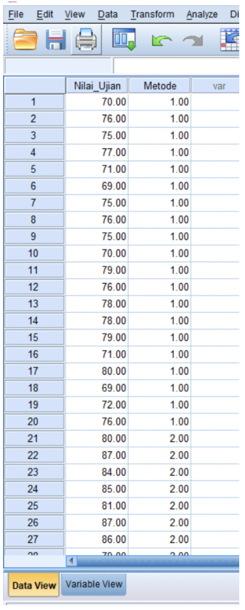
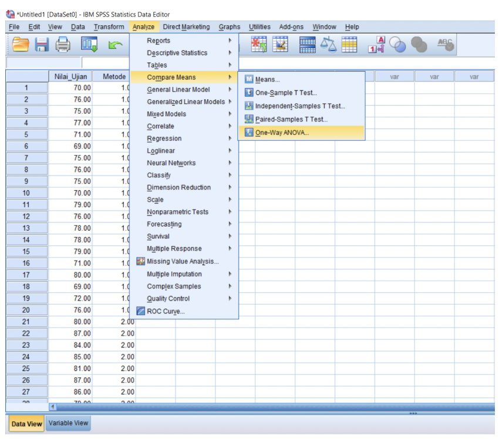
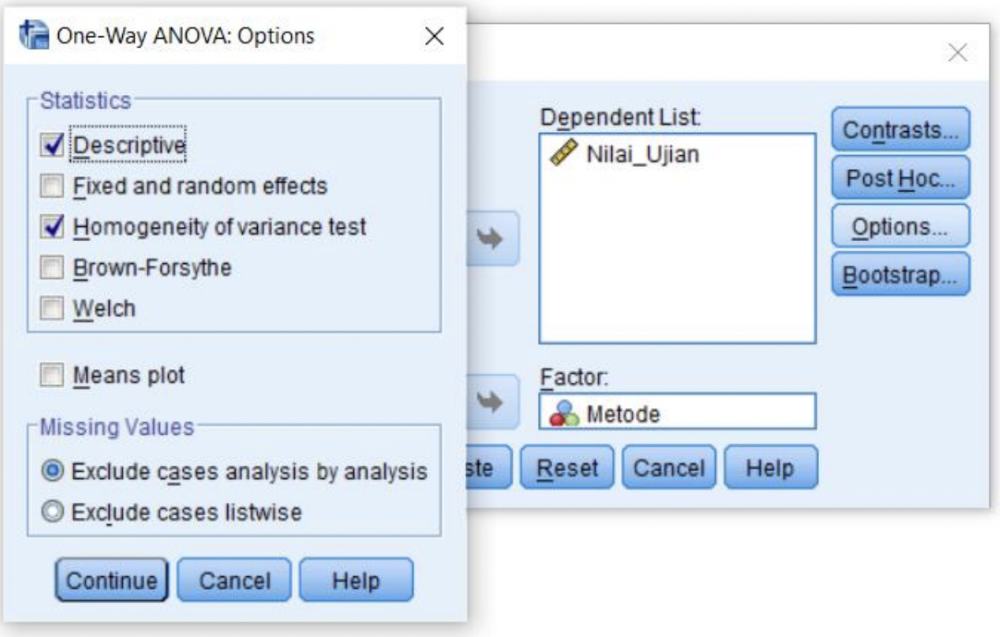
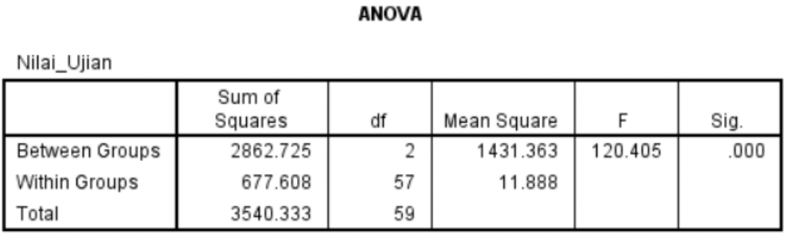

# Apa Itu One Way Anova ?

Uji one way Anova adalah metode analisis statistik multivariate yang dapat digunakan untuk dapat melihat  apakah terdapat perbedaan rata-rata antara dua kelompok atau lebih. Pada one way anova, pengujian dilakukan ketika sampel yang akan diuji hanya terdapat satu faktor. Untuk memahami teori dasar Anova dapat mengunjungi [artikel berikut ini](/artikel/penjelasan-lengkap-uji-anova/).

## Contoh One Way Anova

Seorang guru ingin mengetahui apakah terdapat perbedaan nilai jika menerapkan tiga metode pembelajaran yang berbeda pada ketiga kelas siswa SMA kelas XII. Pada kasus ini hanya terdapat 1 faktor yang diteliti yaitu metode pembelajaran.

**Definisi Variabel:**

* Nilai ujian siswa : data numerik (0 sampai 100)
* Metode pembelajaran: data kategorik (metode 1, metode 2, dan metode 3)

# Langkah-langkah Uji Anova di SPSS

## **Contoh penelitian One Way Anova** 

Seorang guru SMA ingin mengetahui apakah terdapat perbedaan nilai ujian dengan menerapkan  tiga metode pembelajaran yang berbeda pada ketiga kelas siswa SMA kelas XII. Terdapat metode  pembelajaran 1, metode pembelajaran 2 dan metode pembelajaran 3. Metode pembelajaran 1  diterapkan pada kelas XII A, metode pembelajaran 2 diterapkan pada kelas XII B dan metode  pembelajaran 3 diterapkan pada kelas XII C.  

**1. Masukan data di SPSS**

Input data pada SPSS seperti gambar di atas, yang ditunjukkan melalui dua variabel.  Variabel nilai ujian masing-masing kelas yang akan dilakukan uji pada satu kolom serta variabel  metode yang menunjukkan perlakuan metode pembelajaran di masing-masing kelas pada kolom  lainnya.

**2. Pilih Menu Analyze,** Compare Means dan pilih One Way Anova 

**3. Masukan Variabel**

 ilai ujian pada “Dependen List” serta variabel metode pada “Faktor”,  lalu klik Options.

4. **Setting menu Options,** centang “Descriptive” dan “Homogeneity of variance test” lalu klik  continue dan selanjutnya klik Ok  

Setelah anda melakukan semua langkah diatas maka anda akan mendapatkan outpus Anova sebagai berikut:

Anda telah mendapatkan semua output yang dibutuhkan dalam analisis anova satu arah, selanjutnya adalah menganalisis output untuk menjawab contoh kasus diatas. Untuk lebih lengkap anda bisa melanjutkan membaca di [link berikut](/artikel/interpretasi-one-way-anova-spss/)