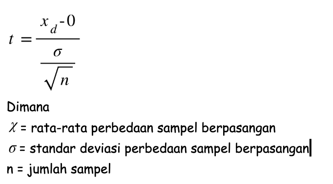

Uji t satu sampel adalah metode statistik yang digunakan untuk mengetahui apakah rata-rata satu sampel dari sebuah pengamatan memiliki perbedaan dengan rata-rata tertentu. Misalkan Anda ingin mengetahui apakah produksi laptop merk X memiliki berat dibawah 5 kg. Untuk menguji hipotesis ini, Anda dapat mengumpulkan sampel laptop merk X, mengukur bobotnya, dan membandingkan sampel tersebut dengan berat 5 kg menggunakan uji t satu sampel .

# Hipotesis Uji T Satu Arah

Ada dua macam hipotesis untuk uji t satu sampel , hipotesis nol dan hipotesis alternatif . Hipotesis alternatif mengasumsikan bahwa ada beberapa perbedaan antara rata-rata sebenarnya (μ) dan nilai perbandingan (m0), sedangkan hipotesis nol mengasumsikan bahwa tidak ada perbedaan. Tujuan dari satu sampel t-test adalah untuk mengetahui apakah hipotesis nol harus ditolak, dengan data sampel yang ada. 

Hipotesis alternatif dapat mengatui dari tiga kemungkinan dari pertanyaan penelitian. Jika tujuannya adalah untuk mengukur perbedaan apa pun, terlepas dari arahnya, hipotesis dua arah digunakan. Jika arah perbedaan antara rata-rata sampel dan nilai perbandingan ingin diketahui, maka hipotesis satu arah dapat digunakan. Hipotesis satu arah memiliki definisi lebih dari atau kurang dari dibanding dengan rata-rata yang di tentukan. Berikut adalah macam-macam hipotesis uji t satu sampel:

* Hipotesis nol (𝐻0) mengasumsikan bahwa perbedaan antara rata-rata sebenarnya (𝜇) dan nilai perbandingan (𝑚0) sama dengan nol.
* Hipotesis alternatif dua arah (𝐻1) mengasumsikan bahwa perbedaan antara rata-rata sebenarnya (𝜇) dan nilai perbandingan (𝑚0) tidak sama dengan nol.
* Hipotesis alternatif arah lebih besar (𝐻1) mengasumsikan bahwa rata-rata sebenarnya (𝜇) sampel lebih besar dari nilai pembanding (𝑚0).
* Hipotesis alternatif arah lebih kecil (𝐻1) mengasumsikan bahwa rata-rata sebenarnya (𝜇) sampel lebih kecil dari nilai pembanding (𝑚0).

Hipotesis matematis dari hipotesis nol dan alternatif didefinisikan di bawah ini:

* 𝐻0: 𝜇 =   𝑚0
* 𝐻1: 𝜇 ≠   𝑚0    (dua arah)
* 𝐻1: 𝜇 >   𝑚0    (arah besar)
* 𝐻1: 𝜇 <   𝑚0    (lebih kecil)

**Penting untuk diingat bahwa hipotesis alternatif yang di pilih sesuai dengan tujuan penelitian yang akan kita jawab dan biasanya menggunakan literatur terkait untuk menentukan arah hipotesis alternatif.**

# Asumsi Uji T Satu Arah

Sebagai metode statistik parametrik (statistik untuk memperkirakan parameter yang tidak diketahui), uji- t satu sampel membuat beberapa asumsi. Uji t satu sampel memiliki empat asumsi yaitu:

* Variabel dependen harus numerik (interval/rasio).
* Pengamatan tersebebar secara acak.
* Variabel dependen harus kira-kira terdistribusi secara normal.
* Variabel dependen tidak boleh mengandung outlier.

## Jenis Data

Tes satu sampel t mensyaratkan data sampel numerik / kontinu, karena didasarkan pada distribusi normal. Data numerik dapat kita hitung nilainya (pendapatan, tinggi, berat, dll.). Kebalikan dari data kontinu adalah data diskrit / kategorik, tidak dapat di ukur nilainnya (Rendah, Sedang, Tinggi, dll.). Tetapi, terdapat data diskrit yang dapat dihitung nilainya, yaitu data skala Likert. [Baca Jenis-Jenis Data](/artikel/pahami-jenis-jenis-data-penelitian/)

## Distribusi Acak

Data acak dapat kita ketahui jika proses pengumpulan data dilakukan secara acak. Dalam contohnya, kita mengumpulkan berat laptop merk X secara acak, dibanding memilih sesuai jenis laptop (pengambilan pola sistematis). Hal ini dilakukan untuk mengurangi sampel bias yang akan menyebabkan hasil uji t tidak akurat.

## Normalitas

Untuk menguji asumsi normalitas, terdapat berbagai metode, tetapi yang paling sederhana adalah memeriksa data secara visual menggunakan histogram atau QQ-plot. Dibawah ini adalah contoh data yang berdistribusi normal (berbentuk lonceng)

Histogram dari variabel yang terdistribusi secara normal.

## Outlier

Outlier adalah nilai data yang ekstrem pada sebuah sampel. Misalkan kebanyakan laptop yang tersedia memiliki berat berkisar 5 kilo, tetapi ada laptop merk X yang memiliki berat 10 kg. Maka laptop dengan berat 20 kg ini bisa kita sebut data outlier. Ini adalah kondisi yang berada diluar cakupan penelitian kita, karena kita hanya fokus pada laptop yang berada dibawah 5 kg, sehingga kita dapat menghapus pengamatan tersebut sebelum melakukan uji t. 

Namun, ada nilai ekstrim yang tidak dikategorikan sebagai outlier. Misalkan terdapat laptop yang memiliki berat 0,5 kg. Dalam hal ini, laptop tersebut masih pada cakupan penelitian kita. Untuk melihat apakah data kita ada outlier atau tidak kita bisa menggunakan boxplot untuk mengetahuinya.

Boxplot variabel tanpa outlier

Boxplot variabel dengan outlier.

# Langkah - Langkah Uji T Satu Sampel

1. [Hitung rata-rata sampel](/artikel/rumus-statistik-deskriptif-yang-sering-digunakan/#rata-rata-sampel)
2. [Hitung standar deviasi sampel](/artikel/rumus-statistik-deskriptif-yang-sering-digunakan/#standar-deviasi-sampel)
3. Hitung statistik uji t

   
4. Hitung probabilitas hasil perhitungan rumus diatas. Untuk mendapatkan probabilitas anda bisa melihat pada t tabel. Kemudian bandingkan nilai probabilitas tersebut dengan nilai signifikansi (5%), jika nilai probabilitas diatas 5% maka terima H0.

# Interpretasi Uji T Satu Arah

Ada dua jenis interpretasi ketika membaca hasil dari perhitungan uji-t satu sampel, yaitu interpretasi inferensial dan interpretasi deskriptif

## **Interpretasi Deskriptif**

Interpretasi deskriptif dapat kita lihat dari nilai rata-rata sampel dan nilai rata-rata yang ditentukan. Mudahnya, jika nilai rata-rata perbedaanya kecil maka kita akan menyimpulkan hipotesis nol benar. Tetapi, dalam menentukan besar kecilnnya perbedaan tersebut sangatlah subjektif. Hal tersebut menyebabkan kesimpulan yang akan di dapatkan untuk setiap peneliti akan berbeda-beda. Sehingga untuk mendapatkan kesimpulan yang objektif kita harus menggunakan interpretasi inferensial.

## **Interpretasi** Inferensial

Interpretasi inferensial ditentukan dengan melihat nilai p. Nilai - p memberikan probabilitas untuk mengetahui apakah kita menerima hipotesis nol atau tidak. Semakin rendah p -value, semakin rendah kemungkinan mendapatkan hasil hipotesis nol itu benar. Jadi, p rendah-nilai kecenderungannya kita akan menolak hipotesis nol. Dan sebaliknnya, jika p besar maka kecenderungannya akan menerima hipotesis nol. Nilai batas probabilitas biasanya menggunakan tingkat signifikansi sebesar 5%.